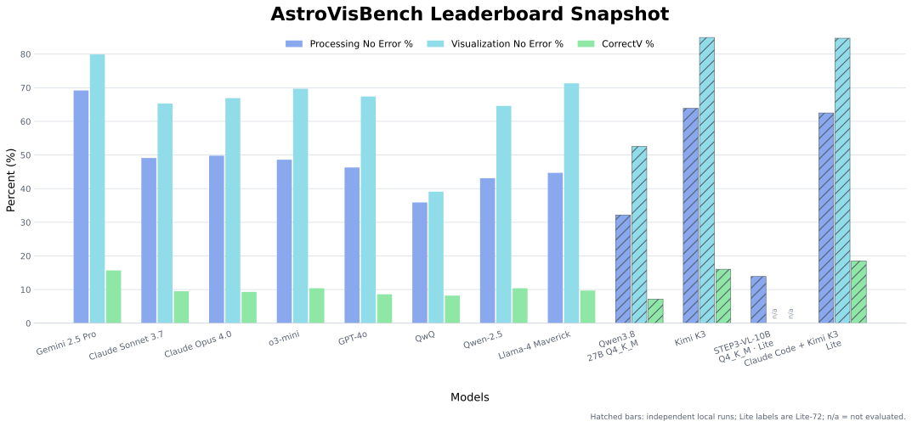

# Astronomy workflows. Reproducible model evaluations.

How well can a language model turn an astronomy request into working analysis code and a scientifically correct visualization?

We evaluate models on **AstroVisBench**, preserve their generated code and evaluation records, and report what succeeds, what fails, and under which conditions. Our aim is to make new evaluations easier to run and results easier to compare over time.

This is an **independent evaluation project**, built on the original AstroVisBench benchmark. It is not the official AstroVisBench website or leaderboard.

[Results](#results) · [Workflow](#workflow) · [Lite benchmark](#a-smaller-benchmark) · [Coding agents](#coding-agents) · [Reproducibility](#reproducibility) · [Credits](#credits)

**Content snapshot: 8 October 2026.** This page contains two audited Full-432 local-model results, a processing-only STEP3-VL Lite result, and a Claude Code + Kimi K3 Lite T1 agent result. Further models will be added after their results and provenance are checked.

## What we measure

AstroVisBench contains **432 workflows from 110 source notebooks**. Each workflow contains a processing task and a visualization task: **864 code-generation tasks in total**.

- **Processing:** Can the model produce the data products needed for the analysis?
- **Visualization:** Can it create a plot that communicates the requested scientific information correctly?

Successful execution alone does not establish scientific correctness. We report execution success, variable inspection, and visualization quality separately.

The original benchmark deliberately evaluates visualization with **reference processing code supplied as context**. It does not require the visualization stage to rely on the model's own processing output. We preserve that distinction.

## Results

### Leaderboard snapshot · Full-432 and Lite-72

The figure and table below combine the published AstroVisBench reference rows with our independently audited Full-432 Qwen3.8 and Kimi K3 runs and the Claude Code + K3 (lite-72 subset) row. The STEP3-VL processing-only result is documented separately below and is intentionally not plotted here. The published rows reproduce the official leaderboard snapshot; hatched rows are our local evaluations. **Because the judge, transport, suite, and (for Claude Code + K3) tool protocols differ, these rows are shown for context and must not be treated as directly comparable replacements for the published rows.**

*Hatched bars identify independent local evaluations. The **(lite-72 subset)** label identifies the fixed sampled-subset Claude Code + K3 row. STEP3-VL is processing-only and is documented below, not plotted here. The published reference rows are reproduced from the official leaderboard snapshot available on 30 September 2026.*

| Model | Suite | Processing no error ↑ | VIscore ↑ | Visualization no error ↑ | CorrectV ↑ | VisFail ↓ | Minor error ↓ | Major error ↓ |
|---|---|---:|---:|---:|---:|---:|---:|---:|
| Gemini 2.5 Pro | Full-432 | 69.20% | 0.600 | 79.90% | 15.70% | 9.30% | 25.90% | 28.50% |
| Claude Sonnet 3.7 | Full-432 | 49.10% | 0.633 | 65.30% | 9.50% | 21.30% | 14.60% | 19.20% |
| Claude Opus 4.0 | Full-432 | 49.80% | 0.644 | 66.90% | 9.30% | 12.70% | 28.90% | 16.00% |
| o3-mini | Full-432 | 48.60% | 0.694 | 69.70% | 10.40% | 2.80% | 26.40% | 29.60% |
| GPT-4o | Full-432 | 46.30% | 0.480 | 67.40% | 8.60% | 6.00% | 23.40% | 28.50% |
| QwQ | Full-432 | 35.90% | 0.472 | 39.10% | 8.20% | 3.90% | 12.60% | 14.90% |
| Qwen-2.5 | Full-432 | 43.10% | 0.527 | 64.60% | 10.40% | 3.70% | 20.10% | 29.90% |
| Llama-4 Maverick | Full-432 | 44.70% | 0.546 | 71.30% | 9.70% | 9.00% | 21.50% | 30.60% |
| Qwen3.8-27B Q4_K_M† | Full-432 | 32.18% | 0.474 | 52.55% | 7.18% | 9.95% | 10.49% | 24.92% |
| Kimi K3† | Full-432 | 63.89% | 0.722 | 84.95% | 16.05% | 10.88% | 18.13% | 31.79% |
| Claude Code + Kimi K3‡ | (lite-72 subset) T1 agent | 62.50% | 0.657 | 84.72% | 18.52% | 11.11% | 19.44% | 35.65% |

† Independent Full-432 local run, three GPT-6 Astra medium judge trials; see the [Qwen3.8 provenance record](data/qwen38-audit.json) and [Kimi K3 provenance record](data/k3-audit.json). ‡ Independent Lite-72 Claude Code + K3 run; see the [Claude Code + K3 provenance record](data/claude-k3-lite-audit.json). The STEP3-VL processing-only record is linked below. Published rows are reference values from the [official leaderboard](https://astrovisbench.github.io/), not rerun in this project.

**Coverage:** Qwen3.8 and Kimi K3 each have 432 executed workflows and three recorded visualization outcomes per workflow. The plotted Claude Code + K3 row covers 72 Lite workflows and has 216 recorded visualization-judge outcomes. STEP3-VL covers 72 Lite processing workflows but is not plotted because its visualization judge was not run. These are separate suite and protocol tracks, not one pooled ranking.

**Generation track:** No tools were supplied to the Qwen3.8 or Kimi K3 Full-432 model runs. Qwen3.8 ran through the local model harness; Kimi K3 used the Kimi Code API with `tool_choice=none`. Claude Code + K3 is deliberately separate: its Lite T1 agent could inspect approved text inputs, edit its candidate, run bounded checks, and submit. The operator's use of software to run the benchmark is separate from the evaluated system's permitted capabilities.

**Judge:** All local visualization rows that have judge values requested `gpt-6-astra`, reasoning effort `medium`, and three trials through Codex CLI `0.153.4`. Mac app version `26.908.70816` was supplied by the operator, not detected on the execution host. A requested model name is not proof of an immutable backend model snapshot.

[Download Qwen3.8 provenance](data/qwen38-audit.json) · [Download Kimi K3 provenance](data/k3-audit.json) · [Download STEP3-VL provenance](data/step3-lite-processing.json) · [Download Claude Code + K3 provenance](data/claude-k3-lite-audit.json) · [Original AstroVisBench leaderboard](https://astrovisbench.github.io/)

### STEP3-VL · Lite-72 processing-only

The Step3-VL-10B Q4_K_M run has completed generation and execution for the full source run. The table below reports the frozen **Lite-72 processing stage only**. It is intentionally not included in the snapshot above because no visualization judge score was run.

| Model | Suite | Processing no error ↑ | VIscore ↑ | VIscore-eligible workflows | Visualization judge |
|---|---|---:|---:|---:|---|
| Step3-VL-10B Q4_K_M‡ | Lite-72 candidate v1 | 13.89% | 0.714 | 7 / 72 | Not run |

‡ The GGUF projector was retained locally but rejected by the llama.cpp build (`missing mm.1.weight`), so this was a text-only Step3-VL generation run rather than a vision-capable evaluation. See the [STEP3-VL processing record](data/step3-lite-processing.json) for checksums, model revision, and the recorded limitation. This row is not a Full-432 score and has no visualization-error categories.

### Claude Code + Kimi K3 · Lite-72 T1

This row evaluates the **Claude Code + K3** system, not K3 in isolation. It is a separate T1 coding-agent experiment with a fresh session for each stage, approved text/tools, three candidate checks, two feedback corrections, and no image viewing. The agent result is therefore not directly comparable to the no-tool Full-432 rows or to the Kimi K3 Full-432 row.

See the [Claude Code + K3 audit record](data/claude-k3-lite-audit.json) for the stage limits, execution checksum, judge provenance, and metric denominators.

### Reading the metrics

| Metric | Interpretation |
|---|---|
| Processing no error | Percentage of workflows whose generated processing code executes without crashing. |
| VIscore | Mean upstream unweighted variable-inspection score among successful processing runs with nonempty inspections. The Qwen3.8 and Kimi K3 Full-432 rows have 108 and 113 eligible workflows; the STEP3-VL and Claude Code + K3 Lite rows have 7 and 33. |
| Visualization no error | Percentage of workflows whose generated visualization code executes without crashing. |
| CorrectV | Percentage assigned “No Error” by the visualization judge. |
| VisFail | Percentage that fail the evaluator's requirement to produce the expected single visualization. |
| Minor / Major error | Percentage assigned the corresponding visualization-error category. |

For this page, visualization category percentages are **averaged across the three trials**, using all workflows as the denominator for each trial. They are not majority-vote scores and are not restricted to successful plots. For the Qwen3.8 Full-432 row, the visualization crash rate is **47.45%**; crash, VisFail, CorrectV, minor error, and major error together account for all outcomes, apart from rounding.

The local upstream-compatible JSON export stores trial 1 in its single-result field. We explicitly identify our three-trial aggregation so that an export convention is not mistaken for a different model result. For QWEN, first-trial CorrectV happens to equal the three-trial mean.

## Workflow

**Prepare → Generate → Execute → Judge → Aggregate**

### 1. Prepare a fixed experiment

Pin the upstream source revision, dataset, model weights, dependencies, and evaluation configuration. Choose either the full benchmark or an explicitly versioned subset of task UIDs. Check that reference workflows and required inputs are available in the execution environment.

### 2. Generate code

Use the pinned upstream prompt construction for processing and visualization. Preserve the original stage-specific context and capture raw requests and responses. Record any transport adaptation or response extraction, including removal of a model's native reasoning block.

For the standard model track, generation has no tool calls, execution feedback, or iterative code repair. Complete and checkpoint generation for the declared suite before final execution.

### 3. Execute the frozen submissions

Run generated code through the pinned upstream executor. Preserve variable-inspection checks, visualization outputs, exceptions, and relevant environment details. Keep generated submissions unchanged; do not manually repair code to improve scores.

### 4. Judge completed visualization outputs

Apply the pinned visualization rubric and record three trials, the requested judge model and settings, and the returned metadata that the provider exposes. Keep crashes, visualization-format failures, and judge invocation failures distinguishable. Invocation failures remain pending until resolved; they are not scientific judgments of the model.

### 5. Aggregate and publish

Verify task coverage and metric denominators. Publish a compact score record, configuration, checksums, and an explanation of any protocol differences. Preserve earlier runs rather than silently replacing them.

Implementation follows the [original repository workflow](https://github.com/NSF-Simons-CosmicAI-Institute/AstroVisBench). The portable public runner and installation guide are being prepared; this draft does not advertise an unimplemented one-command interface.

## A smaller benchmark

A full run can be expensive. We are preparing a smaller, fixed suite for routine model screening while retaining both processing and visualization tasks and the same evaluation procedure.

| Suite | Workflows | Generation tasks | Intended use | Status |
|---|---:|---:|---|---|
| Smoke | 12 | 24 | Verify the installation and complete pipeline | Planned; task list not yet frozen |
| Lite | 72 | 144 | Lower-cost screening across scientific applications | Candidate v1; requires validation |
| Full | 432 | 864 | Reference evaluation | Completed QWEN result above |

Lite uses one-sixth as many workflows as Full, but this is **not a promise of one-sixth the runtime or cost**. Task runtimes vary, and setup has fixed costs. Three visualization-judge trials give up to 216 LLM calls for Lite before retries; crashes and VisFail outcomes do not require those calls.

### Lite-72 candidate v1

The current candidate selects **72 workflows from 62 source notebooks**, with 12 from each provisional source-notebook family:

- Spectroscopy
- Photometry
- Image processing
- Time-series analysis
- Cosmology and spatial structure
- Simulation and modeling

Each family contributes four workflows from each of three code-length bands. Code length is a complexity proxy, not a measured difficulty score. A fixed seed and recorded selection procedure favor notebook diversity. **Selection did not use QWEN outcomes, and the subset was not tuned afterward to match its full-run scores.**

These are provisional notebook-family labels, not verified classifications of individual tasks. A photometry notebook can contain a spectral plot, and the current spatial-structure family includes Galactic structures and HEALPix maps. Task-level labels and secondary tags need review before a public Lite release.

[Download candidate UID manifest](data/lite72-candidate-v1.json) · [Download selected tasks and QWEN outcomes (CSV)](data/lite72-qwen-tasks.csv)

### Does the candidate reproduce the full result?

Not closely enough to claim that it replaces the full benchmark.

| Qwen3.8-27B Q4_K_M | Full-432 | Lite-72 candidate |
|---|---:|---:|
| Processing no error | 32.18% | 37.50% |
| VIscore | 0.474 | 0.381 |
| Visualization no error | 52.55% | 56.94% |
| CorrectV | 7.18% | 11.11% |
| VisFail | 9.95% | 13.89% |

Lite's VIscore uses 21 eligible workflows, compared with 108 for Full. All percentages use the same definitions as the full result above.

Equal family allocation changes the mixture of tasks relative to Full. This first candidate gives higher execution success and CorrectV, but lower VIscore. One model cannot establish ranking stability across models. We will review scientific coverage and compare fixed-subset results across additional completed models before freezing Lite v1.

Lite results will be presented separately from Full results. Arbitrary custom subsets are useful for development, but do not belong in the standard rankings. A first-N slice is not our selection method.

## Coding agents

Tool-assisted coding is a separate experimental track. Its unit of comparison is **model + harness/version + permitted tools + budget**, rather than the model name alone.

The draft protocol distinguishes three profiles:

| Profile | Evaluated system may do |
|---|---|
| T0 | Generate code using the original no-tool protocol |
| T1 | Read approved inputs, edit its code, and run a bounded number of candidate checks |
| T2 | T1 plus inspect images produced by its own candidate code |

Tool-assisted runs must declare iteration, execution, token, and wall-clock limits. Reference answers, hidden evaluation feedback, other models' results, and reference plots remain outside the evaluated agent's accessible workspace. The original reference processing context is still supplied in the visualization stage.

Agent scores are displayed separately from T0 scores. Manually supervised pilots or products with unobservable budgets will be identified as such. The Claude Code + K3 Lite row is the first T1 agent entry in this snapshot and is labelled accordingly; it is not part of the no-tool ranking.

## Reproducibility

Each published result should identify:

- The model repository, immutable weight revision, parameter size, and quantization.
- The runtime and harness versions, generation settings, prompt construction, and tool policy.
- The source revision, dataset checksum, subset manifest, and task coverage.
- The execution environment, hardware, executor settings, and declared modifications.
- The judge prompt, requested model, reasoning settings, trial count, transport version, and available response metadata.
- The aggregation rule, metric denominators, pending records, and known limitations.

The current reference inputs are:

| Component | Pinned identifier |
|---|---|
| Upstream source | `707657f8fac4df50a6cf6c2c4671bf6a0258a201` |
| Dataset revision | `43e4784c638f946b8362bc5ecaef4117d3dc7752` |
| Dataset SHA-256 | `c48528947378e138c8c1df26531f1fd37e96a9226a52659ea838cc543a8e22e2` |
| QWEN weight revision | `0669b98607d47046c7c2b3f801011d54a08cfccf` |
| Kimi generation transport | Kimi Code API, requested model `k3` |
| STEP3-VL weight revision | `4e88ea55358ca8091e495a59414fd4a5d43d6932` (`Q4_K_M`) |
| Claude Code harness | `2.1.285`; K3 requested; T1 protocol |

Reproducibility includes stating what cannot be pinned. Hosted model aliases, unavailable provider metadata, external data services, and nondeterministic execution can limit exact replay. A changed judge or tool policy defines a new evaluation series; it does not silently replace the old one.

### Updates

Results will be added after completed runs are audited. Each update should state the model and protocol, suite, coverage, and any corrections. We do not commit to a fixed update schedule.

- **30 September 2026:** Prepared this public-content draft with the audited QWEN Full-432 result and the exploratory Lite-72 comparison. These are local artifacts; this entry does not indicate that the website has been deployed.
- **5 October 2026:** Added the audited Kimi K3 Full-432 result and the STEP3-VL Lite-72 processing-only result. STEP3-VL visualization judging remains pending because the recorded run was text-only after the projector compatibility failure.
- **8 October 2026:** Added the Claude Code + K3 Lite-72 T1 result. The snapshot figure now shows the Claude Code + K3 Lite row; STEP3-VL remains documented separately as processing-only and is not plotted.

### Limits of interpretation

These results describe performance on a public collection of astronomy workflows under the recorded conditions. They do not establish general scientific reliability or independence from training-data contamination. Automated visualization judgments can disagree with astronomers. Our GPT-6 judge adapter has not been presented here as a new expert-validated judge calibration.

## Credits

AstroVisBench was introduced by Sebastian Antony Joseph and collaborators. Please cite the original work when using its benchmark, and distinguish this project's new runs and evaluation adaptations from the authors' published results.

[Paper: AstroVisBench](https://arxiv.org/abs/2505.20538) · [Original code](https://github.com/NSF-Simons-CosmicAI-Institute/AstroVisBench) · [Dataset](https://huggingface.co/datasets/sebajoe/AstroVisBench) · [Official website](https://astrovisbench.github.io/)

> Sebastian Antony Joseph et al. (2025). *AstroVisBench: A Code Benchmark for Scientific Computing and Visualization in Astronomy*. arXiv:2505.20538.

Upstream benchmark material retains its applicable attribution and share-alike requirements; model weights remain governed by their own licenses. This project does not redistribute model weights or large execution datasets through the website.
